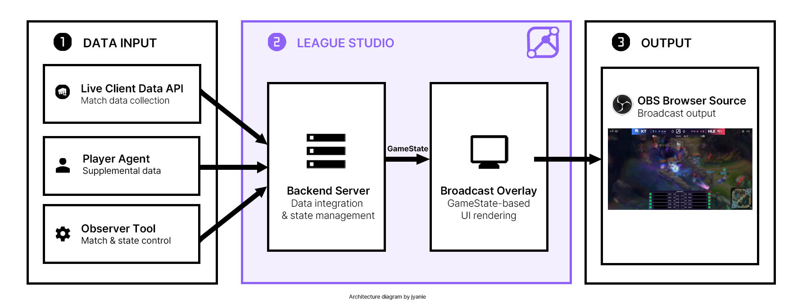

# League Studio

> Real-time broadcast overlay toolkit for League of Legends custom tournaments.

League Studio는 **League of Legends 사설 경기 및 소규모 대회의 관전 방송을 위한 실시간 오버레이 시스템**입니다.

일반적인 사설 경기 환경에서도 경기 정보와 오브젝트 상태를 방송용 UI로 시각화하여, 보다 완성도 높은 관전 화면을 구성할 수 있도록 하는 것을 목표로 합니다.

League Studio는 여러 애플리케이션이 함께 동작하는 프로젝트이며, **이 저장소는 Broadcast Overlay, Backend Server, 그리고 두 애플리케이션이 공유하는 데이터 타입을 관리합니다.**

---

## Project Structure

League Studio는 다음 세 개의 저장소로 구성됩니다.

| Repository | Description |
| --- | --- |
| [**league-studio**](https://github.com/jyaniee/league-studio) | Broadcast Overlay, Backend Server, shared types |
| [**league-studio-observer**](https://github.com/jyaniee/league-studio-observer) | WPF 기반 Observer Tool |
| [**league-studio-agent**](https://github.com/jyaniee/league-studio-agent) | Player-side 보조 데이터 수집 Agent |

각 애플리케이션은 역할이 분리되어 있지만, 최종적으로 Backend Server가 경기 상태를 통합하고 Overlay가 이를 방송 화면에 표현하는 구조로 동작합니다.

---

## Architecture

<!--
Architecture diagram placeholder


-->

League Studio의 Backend Server는 시스템의 **중앙 상태 관리자** 역할을 합니다.

일반적인 경기 데이터는 관전자 환경의 Riot Live Client Data API를 통해 수집하고, 관전자 환경만으로 안정적으로 확인하기 어려운 일부 데이터는 Player Agent를 통해 보완합니다.

Observer Tool은 자동 수집 데이터와 별개로 대회 운영자가 직접 설정하거나 수정해야 하는 정보를 Server에 전달합니다.

Server는 이러한 데이터를 하나의 `GameState`로 통합하여 관리하고, Overlay에 WebSocket으로 전달합니다. Overlay는 전달받은 상태를 기반으로 방송용 UI를 렌더링하며 OBS Studio의 Browser Source 등에서 사용할 수 있습니다.

### Backend Server

Backend Server는 League Studio의 중앙 데이터 계층입니다.

주요 역할은 다음과 같습니다.

- 관전자 환경에서 경기 상태 수집
- Player Agent에서 전달되는 보조 이벤트 수신
- Observer Tool에서 전달되는 경기 정보 및 상태 변경 수신
- 여러 데이터 소스를 하나의 `GameState`로 통합
- Overlay에 `GameState` 실시간 브로드캐스트
- WebSocket 연결 및 heartbeat 관리

### Broadcast Overlay

Overlay는 Backend Server가 전달하는 `GameState`를 기반으로 방송 화면을 렌더링합니다.

현재 개발 중인 주요 UI는 다음과 같습니다.

- 경기 스코어보드
- 팀 정보
- 킬 및 글로벌 골드
- 경기 시간
- 주요 오브젝트 상태
- 선수별 챔피언 정보
- K/D/A
- CS
- 아이템
- 와드 / 장신구 상태

Overlay는 경기 데이터를 직접 수집하지 않고, Server에서 통합된 상태를 표현하는 역할에 집중합니다.

### Observer Tool

Observer Tool은 별도 저장소에서 개발되는 **C# / WPF 기반 데스크톱 애플리케이션**입니다.

자동 데이터 수집과 별개로 대회 운영자가 직접 관리해야 하는 경기 및 방송 정보를 Server에 전달합니다.

예를 들어 다음과 같은 정보를 제어할 수 있습니다.

- 대회 정보
- 세트 번호
- 블루 / 레드 팀 정보
- 팀 로고
- 수동 상태 변경

Repository: [league-studio-observer](https://github.com/jyaniee/league-studio-observer)

### Player Agent

Player Agent는 선수 또는 테스트 클라이언트 환경에서 실행되는 **보조 데이터 수집기**입니다.

관전자 환경의 Live Client Data API에서는 일부 오브젝트 이벤트가 누락될 수 있기 때문에, Player Agent가 선수 클라이언트의 Riot Live Client Data API를 통해 해당 정보를 보완합니다.

현재 다음과 같은 오브젝트 이벤트를 처리합니다.

- Dragon
- Baron
- Rift Herald
- Void Grub

Player Agent는 전체 경기 데이터를 대신 수집하는 구성 요소가 아니라, **관전자 환경에서 안정적으로 얻기 어려운 데이터를 보완하는 역할**을 담당합니다.

Repository: [league-studio-agent](https://github.com/jyaniee/league-studio-agent)

---

## Repository Structure

이 저장소는 `pnpm workspace` 기반 monorepo로 구성되어 있습니다.

```text
league-studio/
├─ apps/
│  ├─ overlay/              # React 기반 Broadcast Overlay
│  └─ server/               # 경기 상태 통합 및 실시간 Server
│
├─ packages/
│  └─ shared-types/         # Overlay / Server 공용 TypeScript 타입
│
├─ package.json
├─ pnpm-workspace.yaml
└─ tsconfig.base.json
```

`overlay`와 `server`는 `@league-studio/shared-types`를 통해 동일한 데이터 구조를 공유합니다.

---

## GameState

`GameState`는 League Studio에서 **현재 경기 상태를 표현하는 핵심 공용 데이터 모델**입니다.

Server는 여러 데이터 소스에서 수집한 정보를 `GameState` 형태로 통합하고, Overlay는 전달받은 `GameState`를 기준으로 각 UI를 렌더링합니다.

공용 타입은 다음 경로에서 관리합니다.

```text
packages/shared-types/src/
```

현재 `GameState`의 최상위 구조는 다음과 같은 정보를 중심으로 구성됩니다.

```ts
interface GameState {
  phase: GamePhase;
  gameTime: number;

  blueTeam: TeamState;
  redTeam: TeamState;

  objectives: GameObjectives;

  source: DataSource;
  updatedAt: string;
}
```

각 팀 상태에는 팀 정보, 킬, 글로벌 골드, 오브젝트 획득 상태 및 선수 정보 등이 포함되며, `GameObjectives`는 Dragon, Baron, Rift Herald, Void Grub 등의 오브젝트 상태를 관리합니다.

Server와 Overlay가 동일한 타입 정의를 공유함으로써 각 애플리케이션에서 데이터 구조를 중복해서 정의하지 않도록 구성하고 있습니다.

새로운 경기 데이터가 필요한 경우에는 특정 애플리케이션 내부에 별도 구조를 임의로 추가하기보다, 필요한 경우 `shared-types`의 데이터 계약을 먼저 확장한 뒤 관련 애플리케이션에서 동일한 타입을 사용하는 것을 기본 원칙으로 합니다.

---

## Tech Stack

### Overlay

- React
- TypeScript
- Vite
- Riot Data Dragon

### Backend Server

- Node.js
- TypeScript
- WebSocket (`ws`)
- Riot Live Client Data API

### Shared

- pnpm workspace
- TypeScript shared types

### Related Applications

- C#
- .NET
- WPF
- OBS Studio

---

## Getting Started

### Requirements

개발 환경에는 다음 도구가 필요합니다.

- Node.js
- pnpm

### Clone

```bash
git clone https://github.com/jyaniee/league-studio.git
cd league-studio
```

### Install Dependencies

```bash
pnpm install
```

### Configure Server

`apps/server/.env.example`을 복사하여 `.env` 파일을 생성합니다.

macOS / Linux:

```bash
cp apps/server/.env.example apps/server/.env
```

Windows PowerShell:

```powershell
Copy-Item apps/server/.env.example apps/server/.env
```

기본 설정에서는 mock GameState를 사용합니다.

```env
USE_MOCK=true
```

실제 Riot Live Client Data API를 이용해 테스트하는 경우 환경에 맞게 Server 설정을 변경합니다.

---

## Development

Server와 Overlay는 각각 별도의 개발 서버로 실행합니다.

### Backend Server

```bash
pnpm dev:server
```

### Broadcast Overlay

```bash
pnpm dev:overlay
```

두 애플리케이션을 함께 테스트하는 경우 각각 별도의 터미널에서 실행하면 됩니다.

---

## Build

### Overlay

```bash
pnpm build:overlay
```

### Server

```bash
pnpm build:server
```

---

## Server Configuration

Server 설정은 `apps/server/.env`에서 관리합니다.

| Variable | Default | Description |
| --- | ---: | --- |
| `WS_PORT` | `8081` | Overlay에 GameState를 전달하는 WebSocket 포트 |
| `GAME_STATE_INTERVAL_MS` | `1000` | GameState broadcast 주기 |
| `WS_HEARTBEAT_INTERVAL_MS` | `30000` | WebSocket heartbeat 주기 |
| `USE_MOCK` | `true` | mock GameState 사용 여부 |
| `ALLOW_INSECURE_LOCAL_TLS` | `false` | 로컬 Live Client API TLS 검증 우회 여부 |
| `AGENT_INGEST_PORT` | `3001` | Player Agent 이벤트 수신 포트 |
| `OBSERVER_INGEST_PORT` | `3002` | Observer Tool 데이터 수신 포트 |
| `HTTP_PORT` | `3000` | 개발 및 디버깅용 HTTP 포트 |

`ALLOW_INSECURE_LOCAL_TLS`는 로컬 개발 환경에서 Riot Live Client API 인증서 문제를 처리하기 위한 설정이며 필요한 경우에만 활성화합니다.

---

## Development Status

League Studio는 현재 개발 중인 프로젝트이며, 기능과 데이터 구조는 개발 진행에 따라 변경될 수 있습니다.

현재 주요 진행 상태는 다음과 같습니다.

- [x] Overlay / Server monorepo 구성
- [x] 공용 `GameState` 타입 구성
- [x] WebSocket 기반 GameState 전달
- [x] WebSocket heartbeat 처리
- [x] Riot Live Client Data API 연동 기반 구성
- [x] Player Agent 오브젝트 이벤트 수신 구조
- [x] Observer Tool 데이터 수신 구조
- [x] 상단 스코어보드 UI
- [x] 하단 선수 정보 패널 UI
- [x] 하단 선수 정보 GameState 바인딩
- [ ] 실제 경기 선수 데이터 전체 연동
- [ ] Overlay 데이터 예외 처리 및 세부 UI 개선
- [ ] Observer Tool 기능 확장
- [ ] 전체 시스템 통합 테스트

---

## Related Repositories

### League Studio Observer

WPF 기반 Observer Tool

https://github.com/jyaniee/league-studio-observer

### League Studio Agent

Riot Live Client Data API를 이용한 Player-side 보조 데이터 수집기

https://github.com/jyaniee/league-studio-agent

---

## Team

**Team X**

| Member | Role |
| --- | --- |
| 심재한 | Frontend / Backend / Observer Tool |
| 문정헌 | Backend / Observer Tool |
| 신홍민 | Backend |
| 이서연 | Frontend |

---

## Disclaimer

League Studio는 Riot Games의 공식 제품이 아니며, Riot Games와 제휴하거나 Riot Games의 보증을 받는 프로젝트가 아닙니다.

League of Legends 및 관련 게임 자산의 권리는 해당 권리자에게 있습니다.