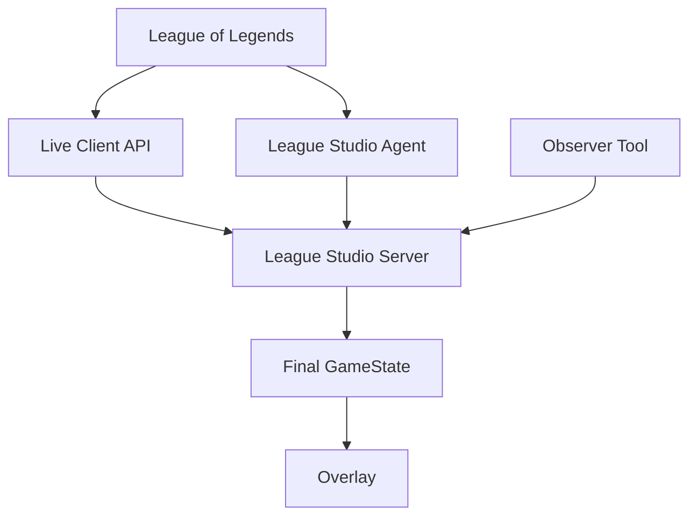
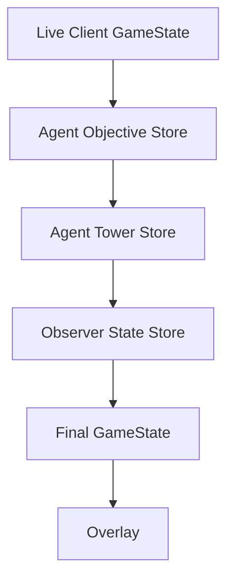

# League Studio Architecture

League Studio를 개발하거나 유지보수하는 개발자가 현재 시스템의 구성과 데이터 흐름을 빠르게 이해할 수 있도록 정리한 문서입니다.

각 컴포넌트가 어떤 데이터를 다루고, Server 내부에서 여러 데이터 소스가 어떻게 하나의 `GameState`로 합쳐지는지를 중심으로 설명합니다.

> **문서 구분**
>
> 현재 실제 구현을 설명하는 내용과 향후 리팩터링 시 고려할 수 있는 방향을 구분하여 작성합니다.  
> 리팩터링 관련 내용에는 아직 구현되지 않은 아이디어가 포함될 수 있습니다.

---

# 1. System Overview

League Studio는 League of Legends 경기 데이터를 여러 경로에서 수집하고 필요한 정보를 보정한 뒤, 최종 `GameState`를 Overlay에 제공합니다.

현재 주요 구성요소는 다음과 같습니다.

- **League Client / Live Client API**
  - 게임에서 직접 제공되는 실시간 데이터를 담당합니다.
- **League Studio Agent**
  - 게임 중 발생하는 이벤트를 감지하여 Server에 전달합니다.
- **Observer Tool**
  - 대회 정보 입력과 자동 수집이 어려운 데이터의 수동 보정을 담당합니다.
- **League Studio Server**
  - Live Client, Agent, Observer 데이터를 통합하여 최종 `GameState`를 생성합니다.
- **Overlay**
  - Server가 제공하는 `GameState`를 기반으로 방송 화면을 렌더링합니다.

---

# 2. High-level Data Flow



세 데이터 소스는 서로 다른 역할을 가집니다.

## Live Client API

Live Client API는 게임에서 직접 제공할 수 있는 기본 데이터를 담당합니다.

예시는 다음과 같습니다.

- 게임 시간
- 선수
- 챔피언
- 포지션
- K/D/A
- CS
- 아이템
- 장신구
- 일부 팀 및 오브젝트 상태

Live Client 데이터는 최종 `GameState`를 구성하는 기본 상태로 사용됩니다.

---

## Agent

Agent는 게임 중 발생하는 이벤트를 감지하고 Server에 전달합니다.

현재 주요 수집 대상은 다음과 같습니다.

- Dragon
- Void Grub
- Rift Herald
- Baron
- Tower

Agent 자체가 전체 `GameState`를 생성하는 것은 아닙니다.

개념적으로는 다음과 같은 이벤트를 Server에 전달합니다.

```text
"Blue Team이 Dragon을 처치했습니다."
"Red Team이 Tower를 파괴했습니다."
```

Server는 전달받은 이벤트를 Store에 누적하고 이후 `GameState`에 반영합니다.

---

## Observer Tool

Observer Tool은 방송 운영자가 직접 관리하거나 보정해야 하는 정보를 Server에 전달합니다.

현재 주요 역할은 다음과 같습니다.

- Match ID
- Observer ID
- Tournament Name
- Set Number
- Blue / Red Team 정보
  - Name
  - Tag
  - Logo
- Global Gold 수동 보정
- Next Dragon 수동 보정

Observer 데이터는 자동 수집만으로 표현하기 어려운 경기 운영 정보나 수동 보정값을 보완하는 역할을 합니다.

---

# 3. Server GameState Composition

Server는 여러 데이터 소스를 순차적으로 병합하여 최종 `GameState`를 생성합니다.

현재 개념적인 흐름은 다음과 같습니다.

```ts
const liveGameState = await getLiveClientGameState();

const withAgentObjectives =
    mergeAgentObjectivesIntoGameState(liveGameState);

const withAgentTowers =
    mergeAgentTowersIntoGameState(withAgentObjectives);

const finalGameState =
    mergeObserverStateIntoGameState(withAgentTowers);

return finalGameState;
```

데이터 흐름으로 표현하면 다음과 같습니다.



현재 병합 순서는 다음과 같이 이해할 수 있습니다.

```text
Live Client
    ↓
Agent Objectives
    ↓
Agent Towers
    ↓
Observer Overrides
    ↓
Final GameState
```

즉 Live Client에서 생성한 기본 상태에 Agent와 Observer의 데이터를 단계적으로 반영합니다.

---

# 4. Server Stores

Server는 서로 다른 종류의 상태를 별도 Store로 관리합니다.

## 4.1 Observer State Store

`observerStateStore.ts`

주요 관리 데이터는 다음과 같습니다.

- `matchId`
- `observerId`
- `tournamentName`
- `setNumber`
- Blue / Red Team 정보
- Global Gold override
- Next Dragon override

Observer에서 기존 경기와 다른 `matchId`가 전달되면 새로운 경기로 판단합니다.

기존 경기가 존재하는 상태에서 다른 `matchId`가 들어오는 경우 현재 구현에서는 다음 상태를 초기화합니다.

```text
Observer State
Agent Objective State
Agent Tower State
```

단, 최초:

```text
null → Match A
```

전환에서는 Agent Store를 초기화하지 않습니다.

Match Info가 Server에 적용되기 전에 Agent가 이미 일부 이벤트를 수집했을 가능성을 고려한 동작입니다.

---

## 4.2 Agent Objective Store

`agentObjectiveStore.ts`

현재 다음 데이터를 관리합니다.

- Dragons
- Elder Dragons
- Void Grubs
- Rift Heralds
- Barons

Tower 상태는 별도의 `AgentTowerStore`에서 관리합니다.

이벤트 중복 적용을 방지하기 위해 다음 형태의 key를 사용합니다.

```text
{matchId}:{eventId}
```

예:

```text
local-test-match:15
```

동일한 경기에서 같은 `eventId`의 이벤트가 다시 전달되면 이미 처리된 이벤트로 판단할 수 있습니다.

---

## 4.3 Agent Tower Store

`agentTowerStore.ts`

현재 다음 데이터를 관리합니다.

```text
Blue Towers
Red Towers
```

Tower Event의 `scoringTeam`을 기준으로 해당 팀의 Tower Count를 증가시킵니다.

예:

```text
destroyedTeam: blue
scoringTeam: red
```

이면:

```text
red.towers += 1
```

로 처리됩니다.

Tower Event 역시 다음 형태의 key를 사용하여 동일 이벤트의 중복 반영을 방지합니다.

```text
{matchId}:{eventId}
```

---

# 5. Match ID

현재 구조를 이해할 때 특히 주의해야 하는 부분입니다.

Agent와 Observer 모두 `matchId`라는 이름을 사용하지만, 현재 두 값은 같은 경로에서 만들어지지 않습니다.

## Observer Match ID

Observer Tool에서 Server로 전달합니다.

```text
Observer Tool
    ↓
ObserverMatchInfoPayload.matchId
ObserverStatePatchPayload.matchId
```

League Studio 운영자가 관리하는 경기 식별자입니다.

예:

```text
final-set-1
final-set-2
```

---

## Agent Match ID

현재 Agent는 환경설정의 `MATCH_ID`를 사용합니다.

개념적으로 다음과 같습니다.

```ts
matchId: process.env.MATCH_ID ?? "local-test-match";
```

이 값은 이후 다음 Payload에 포함되어 Server로 전달됩니다.

```text
AgentObjectiveEventPayload.matchId
AgentTowerEventPayload.matchId
```

---

## Observer와 Agent의 Match ID 관계

두 값 모두 논리적으로는 특정 경기를 식별하기 위해 사용되지만, 현재는 같은 Source of Truth에서 생성되지 않습니다.

예를 들어 다음과 같은 상태도 가능합니다.

```text
Observer:
final-set-1

Agent:
local-test-match
```

따라서 현재 구현에서는 Observer의 `matchId`와 Agent Store의 `currentMatchId`를 직접 같은 값으로 취급하지 않습니다.

현재 흐름은 다음과 같습니다.

```text
Observer에서 새로운 경기 감지
        ↓
Agent Store reset
        ↓
Agent Store currentMatchId = null

다음 Agent Event 도착
        ↓
Agent payload.matchId 기준으로
Agent Store 상태 동기화
```

즉 Observer는 경기 전환에 따라 기존 누적 상태를 초기화하고, Agent Store 내부의 경기 식별은 Agent가 전달한 `matchId`를 기준으로 처리합니다.

---

# 6. Match Lifecycle

경기 상태가 언제 유지되고 언제 초기화되는지 이해하면 Server의 Store 동작을 파악하기 쉬워집니다.

## Initial Match

Server 시작 직후에는 각 Store가 비어 있는 상태입니다.

```text
Observer State          = empty
Agent Objective State   = empty
Agent Tower State       = empty
```

Observer Match Info가 처음 들어오는 경우:

```text
null → Match A
```

이 전환에서는 Agent Store를 강제로 초기화하지 않습니다.

Agent가 Observer Match Info보다 먼저 이벤트를 수집했을 수 있기 때문입니다.

---

## Same Match Update

같은 `matchId`로 Match Info 또는 State Patch가 다시 들어오는 경우:

```text
Match A → Match A
```

기존 Store 상태를 유지합니다.

따라서 경기 도중 팀 정보 수정이나 Manual Override를 적용하더라도 Agent가 이미 수집한 Objective/Tower 상태는 유지됩니다.

---

## New Match

Observer 기준으로:

```text
Match A → Match B
```

전환이 발생하면 현재 구현에서는 다음 상태를 초기화합니다.

```text
Observer State
Agent Objective State
Agent Tower State
```

이전 경기에서 누적된 데이터가 새로운 경기로 넘어가는 것을 방지하기 위한 동작입니다.

---

## Manual Reset

`POST /observer/reset`

은 현재 경기 전체 상태를 초기화하고 새로운 경기를 준비하기 위한 용도로 사용합니다.

따라서 현재 다음 상태를 함께 초기화합니다.

```text
Observer State
Agent Objective State
Agent Tower State
```

---

# 7. Why Stores Reset on Match Change

Agent Store는 Server 메모리에 누적되는 상태입니다.

예를 들어 이전 경기가 다음과 같이 종료되었다고 가정합니다.

```text
Blue Towers: 8
Red Towers: 5
```

새 경기가 시작되어 Live Client 데이터가:

```text
Blue Towers: 0
Red Towers: 0
```

을 제공하더라도 이전 Agent Tower Store가 남아 있으면 다음과 같은 병합이 발생할 수 있습니다.

```ts
Math.max(0, 8); // 8
Math.max(0, 5); // 5
```

이 경우 새 경기가 시작되었는데도 이전 경기의 Tower 값이 표시될 수 있습니다.

따라서 경기 전환 시 이전 경기의 누적 상태를 함께 초기화합니다.

Objective Store 역시 같은 이유로 경기 단위로 상태를 구분할 필요가 있습니다.

---

# 8. Data Responsibility Overview

현재 각 데이터가 주로 어디에서 생성되거나 관리되는지 정리하면 다음과 같습니다.

| Data | Main Source / Store |
| --- | --- |
| Game Time | Live Client |
| Player / Champion | Live Client |
| Position | Live Client |
| K/D/A | Live Client |
| CS | Live Client |
| Items | Live Client |
| Trinket | Live Client |
| Dragon History | Agent Objective Store |
| Void Grubs | Agent Objective Store |
| Rift Herald | Agent Objective Store |
| Baron | Agent Objective Store |
| Towers | Agent Tower Store |
| Team Name | Observer |
| Team Tag | Observer |
| Team Logo | Observer |
| Global Gold Override | Observer |
| Next Dragon Override | Observer |

이 표는 현재 구현을 빠르게 파악하기 위한 참고용입니다.

기능이 추가되면서 데이터 출처가 변경되거나 새로운 Store가 생기는 경우 실제 구현에 맞게 함께 갱신할 수 있습니다.

---

# 9. Current Architectural Characteristics

현재 구조는 MVP 개발 과정에서 기능을 점진적으로 추가하면서 만들어졌습니다.

따라서 몇 가지 부분은 다른 영역보다 구조를 이해하기 위해 더 많은 맥락이 필요합니다.

## 9.1 Match Lifecycle이 여러 Store에 걸쳐 있음

현재 다음 Store가 각각 자체 상태를 가지고 있습니다.

```text
ObserverStateStore
AgentObjectiveStore
AgentTowerStore
```

경기 전환 시 이 상태들을 함께 초기화합니다.

현재 규모에서는 직접 관리할 수 있지만, Store가 더 늘어나면 경기 단위 상태의 lifecycle을 한 곳에서 파악하기 어려워질 수 있습니다.

---

## 9.2 Observer와 Agent Match ID가 별도로 관리됨

현재 Match ID는 다음처럼 서로 다른 경로에서 얻습니다.

```text
Observer → 사용자 입력
Agent    → .env MATCH_ID
```

현재 구현은 두 값을 직접 동일시하지 않는 방식으로 동작합니다.

향후 Match ID의 출처가 하나로 통합된다면 경기 lifecycle을 이해하는 과정이 단순해질 수 있습니다.

---

## 9.3 Agent MATCH_ID Lifecycle

Agent의 `MATCH_ID`는 실행 시 환경설정에서 읽습니다.

Agent 프로세스를 여러 경기에 걸쳐 계속 실행하는 운영 방식을 사용할 경우, 경기 전환과 `MATCH_ID` 갱신을 어떤 방식으로 연결할지 추가로 살펴볼 필요가 있습니다.

---

## 9.4 In-memory State

현재 주요 Store는 Server 프로세스 메모리에 존재합니다.

따라서 Server 프로세스를 재시작하면 누적 상태가 사라집니다.

현재 MVP에서는 허용 가능한 동작일 수 있지만, 실제 운영 방식에 따라 상태 복구가 필요한지 검토할 수 있습니다.

---

# 10. Refactoring Direction

이 섹션은 현재 구현을 설명하는 부분이 아닙니다.

현재 구조를 유지하면서 개발을 진행한 뒤, 복잡도가 더 커졌을 때 고려해볼 수 있는 개선 방향을 기록합니다.

## 10.1 Match Session 개념 도입

현재 여러 Store에 흩어져 있는 경기 상태를 하나의 경기 단위로 묶는 방법을 고려할 수 있습니다.

예:

```ts
type MatchSession = {
    matchId: string;

    observer: ObserverState;
    objectives: AgentObjectiveState;
    towers: AgentTowerState;
};
```

개념적으로는 다음과 같은 형태가 됩니다.

```text
MatchSession
 ├─ Observer State
 ├─ Agent Objective State
 └─ Agent Tower State
```

이 구조는 경기별 상태와 lifecycle을 한 곳에서 이해하는 데 도움이 될 수 있습니다.

---

## 10.2 Match Lifecycle 관리 계층

현재는 경기 상태를 초기화할 때 다음과 같이 여러 Store를 직접 호출합니다.

```ts
resetObserverState();
resetAgentObjectiveStore();
resetAgentTowerStore();
```

Store가 더 늘어날 경우 다음과 같이 경기 lifecycle 자체를 담당하는 계층을 두는 방법을 고려할 수 있습니다.

```ts
resetMatchState();
```

또는:

```ts
startMatch(matchId);
endMatch();
resetMatch();
```

개념적으로는 다음과 같습니다.

```text
Match Lifecycle
      │
      ├─ Observer Store
      ├─ Objective Store
      └─ Tower Store
```

현재 구조에서 반드시 필요한 것은 아니지만, 경기와 관련된 상태가 더 많아질 경우 구조를 단순화하는 방법이 될 수 있습니다.

---

## 10.3 Canonical Match ID

장기적으로 Server가 하나의 Match Session ID를 관리하고 Observer와 Agent가 동일한 식별자를 공유하도록 구성하는 방법을 고려할 수 있습니다.

예:

```text
Server Match Session
        ↓
matchId = final-2026-set-1
        ↓
Observer
Agent
```

이렇게 구성하면 현재처럼 Observer와 Agent가 각자의 `matchId`를 별도로 관리하는 데서 생기는 복잡성을 줄일 수 있습니다.

---

## 10.4 GameState Composition 정리

현재는 여러 merge 함수를 순서대로 호출하여 최종 `GameState`를 생성합니다.

데이터 소스가 더 늘어날 경우 composition 과정을 한 곳에 모으는 형태를 고려할 수 있습니다.

예:

```ts
composeGameState({
    liveClient,
    agentObjectives,
    agentTowers,
    observer,
});
```

이렇게 하면 어떤 데이터 소스가 최종 `GameState` 구성에 참여하는지 한 곳에서 확인하기 쉬워질 수 있습니다.

---

## 10.5 Store Responsibility 정리

현재 Objective와 Tower는 별도 Store에서 관리합니다.

```text
AgentObjectiveStore
→ Dragon / Void Grub / Herald / Baron

AgentTowerStore
→ Tower
```

새로운 데이터가 추가되는 경우 기존 Store에 포함할지 새로운 Store로 분리할지는 데이터 특성과 lifecycle을 기준으로 판단할 수 있습니다.

동일한 데이터를 여러 Store에서 동시에 관리하는 상황이 생기면 어떤 값이 최종적으로 사용되는지 파악하기 어려워질 수 있으므로, 구조를 다시 확인해볼 필요가 있습니다.

---

# 11. Areas Worth Testing

현재 구조를 이해하거나 이후 리팩터링을 진행할 때 다음과 같은 시나리오를 테스트하면 Match lifecycle을 확인하는 데 도움이 됩니다.

```text
Match A 시작
→ Agent Objective/Tower 누적

같은 Match A 정보 재적용
→ 기존 Agent 상태 유지

Match A → Match B
→ 이전 경기 누적 상태 초기화

/observer/reset
→ 현재 경기 전체 상태 초기화

새 Match에서 새로운 Agent Event 수신
→ 0부터 다시 정상적으로 누적
```
이 목록은 현재 경기 상태 흐름을 확인하기 좋은 대표적인 시나리오입니다.

---

# 12 Notes for Developers

이 문서에서 가장 중요한 부분은 각 데이터가 어떤 경로를 통해 최종 GameState에 도달하는지를 이해하는 것입니다.

구조가 헷갈릴 경우 다음 순서로 추적하면 비교적 쉽게 확인할 수 있습니다.

```text
1. 이 데이터는 어디에서 생성되는가?
2. Server의 어느 Store가 저장하는가?
3. 언제 초기화되는가?
4. 어떤 merge 함수에서 GameState에 반영되는가?
5. 최종적으로 Overlay가 어떤 값을 받는가?
```


특히 비슷한 이름의 필드가 여러 컴포넌트에 존재할 수 있으므로 이름만 보고 같은 데이터를 공유한다고 판단하기보다는 실제 데이터 경로를 확인하는 것이 도움이 됩니다.

대표적인 예가 `matchId`입니다.

현재 `matchId`는 Agent와 Observer 양쪽에 존재하지만 출처는 서로 다릅니다.

---

# 13. Summary


현재 League Studio의 데이터 흐름은 다음과 같이 요약할 수 있습니다.

1. Live Client Data가 기본 경기 상태를 제공합니다.
2. Agent가 자동 감지한 Objective와 Tower 이벤트를 Server에 전달합니다.
3. Observer가 경기 운영 정보와 수동 보정값을 제공합니다.
4. Server가 각 데이터를 순차적으로 병합하여 최종 GameState를 생성합니다.
5. 경기가 전환되면 이전 경기에서 누적된 상태를 초기화합니다.

현재 구조를 이해할 때는 특히 다음 세 가지를 함께 보면 좋습니다.
```text
Data Source
Server Store
Match Lifecycle
```
이 세 요소를 기준으로 추적하면 Agent, Observer, Server 사이의 관계를 비교적 명확하게 파악할 수 있습니다.